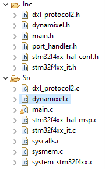

# Read the Doc !
Read the [Doc.pdf](https://github.com/Myrlon/STM32MotorDynamixelTurtleBot/blob/main/Doc.pdf) in the files and follow the instructions to change baudrate and initialize motors and STM32 projects

# STM32MotorDynamixelTurtleBot
Use for basic Nucleo Card (NUCLEO-F446RE) with dynamixel motor, motor of TurtleBot3
Motor used for this project XM430-210T
Motor used in robot TurtleBot3 Waffle model

Theres a doc based on TurtleBOT3 with OpenCR and starting testing motors and a electronic assembly diagram

Don't forget to change motor's baudrate as explained in the [Doc.pdf](https://github.com/Myrlon/STM32MotorDynamixelTurtleBot/blob/main/Doc.pdf)

## 1. Download library files
Just pick src and include files to put into your project and adjust the settings as you want

## 2. Take The Release
The release is a project example in STM32 for NUCLEO-F446RE, you can download it and test it


Here how your files should look like :



Main Code

### Init

```c
/* USER CODE BEGIN 2 */
    HAL_UARTEx_ReceiveToIdle_IT(&huart1, rx, sizeof(rx));
    Dxl_Init(&huart1);
	MPU6050_init();
  /* USER CODE END 2 */
```
### Read IMU MOU6050 data
```c
MPU6050_Read_Accel(&Ax, &Ay, &Az);
  MPU6050_Read_Gyro(&Gx, &Gy, &Gz);
  ```
  ### Reading and writing
  With 
  ```c
      Dxl_SetOperatingMode(id, 1);
```
Move motor with velocity
  ```c
  Dxl_MoveVel(1,150);
  HAL_Delay(100);
  Dxl_MoveVel(2, -70);

  ```

With 

  ```c
      Dxl_SetOperatingMode(id, 3);
```
Move motor with position
  ```c
 Dxl_MovePos(1, FORWARD);
  HAL_Delay(100);
  Dxl_MovePos(2, FORWARD);
  ```

